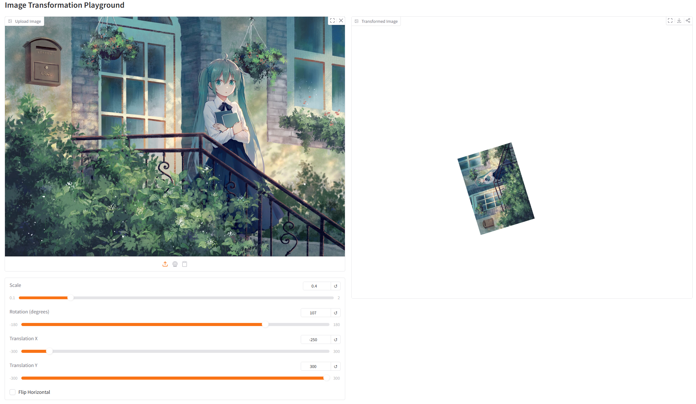
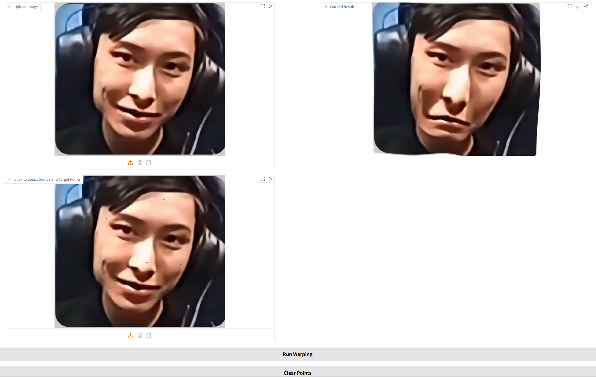

# DIP Assignment 01: Image Warping Report

This repository is the official implementation of DIP Assignment 01 (Image Warping).

## 1. Introduction

本作业实现两类图像变换任务：

1. 全局几何变换（缩放、旋转、平移、水平翻转）。
2. 基于控制点的非刚性形变（RBF/TPS）。

目标是通过交互式界面观察几何变换与点引导形变对图像结构的影响，并分析参数变化对结果的作用。

## 2. Method

### 2.1 Global Geometric Transformation

实现文件：[run_global_transform.py](run_global_transform.py)

对输入图像进行如下组合变换：

1. 水平翻转（可选）。
2. 以图像中心为基准进行缩放。
3. 以图像中心为基准进行旋转。
4. 平移（x, y）。

通过将 2x3 仿射矩阵扩展为 3x3 齐次矩阵并相乘，得到最终组合变换矩阵，再由 `cv2.warpAffine` 生成结果。

### 2.2 Point-Guided Deformation (RBF/TPS)

实现文件：[run_point_transform.py](run_point_transform.py)

采用 RBF 中常用的 Thin Plate Spline (TPS) 核进行形变场拟合。

1. 用户在界面上交替点击源点和目标点，构成控制点对。
2. 建立从目标坐标到源坐标的反向映射函数，避免前向映射造成空洞。
3. 对全图像素网格计算映射坐标，并使用 `cv2.remap` 双线性采样得到形变图像。
4. 控制点较少时使用平滑回退策略，提升数值稳定性。

## 3. Requirements

### 3.1 Installation (pip)

```bash
python -m pip install -r requirements.txt
```

### 3.2 Installation (conda)

```bash
conda create -n dip26 python=3.10 -y
conda run -n dip26 python -m pip install -r requirements.txt
```

依赖列表见 [requirements.txt](requirements.txt)。

## 4. Running Script

### 4.1 Global Transform Demo

```bash
python run_global_transform.py
```

### 4.2 Point-Guided Warping Demo

```bash
python run_point_transform.py
```

运行后终端会打印本地 Gradio 地址（通常为 `http://127.0.0.1:7860`），在浏览器打开即可交互。

## 5. Input and Output Specification

### 5.1 Global Transform

输入：

1. 一张 RGB 图像。
2. 参数：`scale`、`rotation`、`translation_x`、`translation_y`、`flip_horizontal`。

输出：

1. 经过组合仿射变换后的图像。

### 5.2 Point-Guided Deformation

输入：

1. 一张 RGB 图像。
2. 多组控制点对（点击顺序为：源点、目标点、源点、目标点...）。

输出：

1. 与控制点约束一致的形变结果图像。

## 6. Experimental Results and Analysis

### 6.1 Visual Results

全局变换示例：



点引导形变示例：



### 6.2 Analysis

1. 全局变换中，中心旋转和中心缩放可以保持主体在画面中的稳定位置，视觉上更自然。
2. 点引导形变中，控制点越多，局部可控性越强；但若点过于密集或分布不均，可能引入局部拉伸伪影。
3. 采用反向映射与插值采样后，能够避免明显空洞并保证边界连续性。
4. TPS 具备较好的平滑性，适合演示非刚性编辑，但在极端位移下仍可能出现边缘变形。

## 7. Conclusion

本作业完成了从全局仿射到局部非刚性形变的基础实现，并通过 Gradio 提供交互式实验界面。实验表明：

1. 全局几何变换适合整体姿态和尺度调整。
2. RBF/TPS 适合局部结构编辑与点约束驱动形变。
3. 控制点数量、分布和位移幅度对最终形变质量具有决定性影响。


## 8. References

1. Schaefer, S., McPhail, T., Warren, J. Image Deformation Using Moving Least Squares. SIGGRAPH 2006.  
	Link: https://people.engr.tamu.edu/schaefer/research/mls.pdf
2. Arad, N., Reisfeld, D., Yeshurun, Y. Image Warping by Radial Basis Functions. CVGIP: Graphical Models and Image Processing, 1995.  
	Link: https://www.sci.utah.edu/~gerig/CS6640-F2010/Project3/Arad-1995.pdf
3. OpenCV Documentation: Geometric Transformations.  
	Link: https://docs.opencv.org/4.x/da/d6e/tutorial_py_geometric_transformations.html
4. Gradio Documentation.  
	Link: https://www.gradio.app/
5. Papers with Code README template (report format reference).  
	Link: https://github.com/paperswithcode/releasing-research-code/blob/master/templates/README.md
