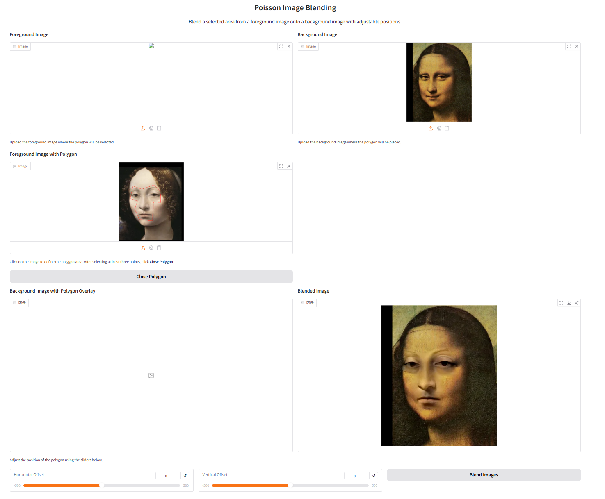
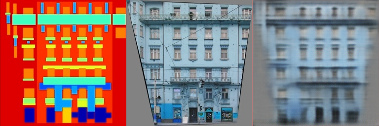
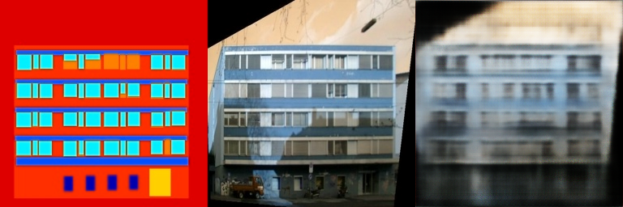
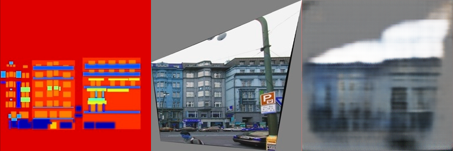
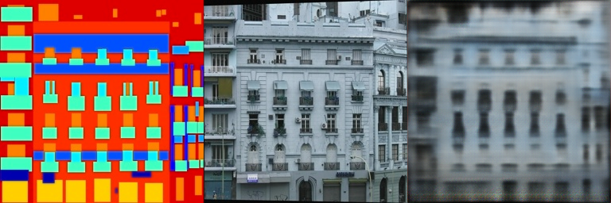
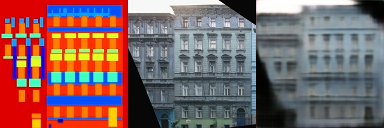

# DIP Assignment 02: DIP with PyTorch Report

This repository is the official implementation of DIP Assignment 02 (Poisson Image Editing and Pix2Pix with PyTorch).

## 1. Introduction

本作业包含两部分：

1. 传统图像编辑方法：Poisson Image Editing（梯度域融合）。
2. 深度学习图像到图像翻译：基于全卷积网络的 Pix2Pix 训练与验证。

目标是理解并实现从经典优化方法到深度学习方法的两种 DIP 解决路径，并比较其建模方式与表现特性。

## 2. Method

### 2.1 Poisson Image Editing (PyTorch Optimization)

实现文件：[run_blending_gradio.py](run_blending_gradio.py)

主要流程如下：

1. 用户在前景图交互式勾画多边形区域。
2. 将多边形区域栅格化为二值掩码（区域内为 255，区域外为 0）。
3. 根据平移参数 (dx, dy) 将前景区域映射到背景位置。
4. 在背景掩码区域内，以拉普拉斯约束最小化前景与融合结果的梯度差，使用 Adam 迭代优化。

其中拉普拉斯项采用卷积核

$$
\begin{bmatrix}
0 & 1 & 0 \\
1 & -4 & 1 \\
0 & 1 & 0
\end{bmatrix}
$$

分别计算前景与融合结果的二阶差分，再在掩码区域内计算均方误差。

### 2.2 Pix2Pix with Fully Convolutional Network

实现文件：[Pix2Pix/FCN_network.py](Pix2Pix/FCN_network.py)

网络采用 Encoder-Decoder 全卷积结构：

1. 编码器：5 层步长为 2 的卷积，通道逐步提升，提取语义特征。
2. 解码器：5 层反卷积逐步恢复分辨率。
3. 输出层：3 通道 RGB，使用 Tanh 约束输出到 [-1, 1]，与数据预处理一致。

训练脚本：[Pix2Pix/train.py](Pix2Pix/train.py)

1. 数据读取 facades 成对图像（左真实 facade / 右语义 label）。
2. 训练方向为 输入 label，输出真实 facade，并采用 L1 损失监督。
3. 训练集使用成对随机水平翻转增强，保证输入与目标同步变换，以提升泛化能力。
4. 训练中加入 Dropout 与 weight decay 等正则化，并通过较小默认学习率稳定优化。
5. 每隔固定 epoch 保存训练与验证可视化结果及模型权重。

## 3. Requirements

### 3.1 Installation (pip)

```bash
python -m pip install torch torchvision torchaudio --index-url https://download.pytorch.org/whl/cu121
python -m pip install gradio numpy pillow opencv-python
```

如果没有 CUDA，可将第一条命令替换为 PyTorch 官网提供的 CPU 安装命令。

### 3.2 Installation (conda)

```bash
conda create -n dip26 python=3.10 -y
conda run -n dip26 python -m pip install torch torchvision torchaudio --index-url https://download.pytorch.org/whl/cu121
conda run -n dip26 python -m pip install gradio numpy pillow opencv-python
```

## 4. Running Script

### 4.1 Poisson Blending Demo

```bash
python run_blending_gradio.py
```

运行后在浏览器打开本地 Gradio 地址（http://127.0.0.1:7860）。

### 4.2 Pix2Pix Training

```bash
cd Pix2Pix
bash download_facades_dataset.sh
python train.py
```

Windows (PowerShell/cmd) 可直接使用：

```bash
cd Pix2Pix
python download_facades_dataset.py --dataset facades
python train.py --direction right2left
```

快速训练：

```bash
cd Pix2Pix
python train.py --direction right2left --batch-size 16 --epochs 40 --num-workers 0 --log-interval 50
```

说明：`--log-interval 50` 表示每 50 个 batch 打印一次训练损失。
可视化结果与 checkpoint 默认改为每 20 个 epoch 保存一次，避免目录过多。
当前训练脚本支持 `--direction left2right|right2left`意为输入和输出的方向。如`facades`数据集为右边输入，左边输出。

使用更多数据集：

```bash
cd Pix2Pix
python download_facades_dataset.py --dataset maps
python train.py --direction left2right --batch-size 16 --epochs 40 --num-workers 0 --log-interval 50
```

可选数据集：`facades`、`cityscapes`、`edges2shoes`、`edges2handbags`、`night2day`、`maps`。

## 5. Input and Output Specification

### 5.1 Poisson Image Editing

输入：

1. 前景图与背景图。
2. 前景图上的闭合多边形选区。
3. 平移参数 dx、dy。

输出：

1. 背景图上的融合结果图像（在选区位置实现梯度域平滑融合）。

### 5.2 Pix2Pix

输入：

1. 成对训练图像（语义图与真实图拼接格式）。
2. 数据布局：左半部分为真实 facade，右半部分为语义 label。
3. 训练映射：label -> facade。
4. 训练参数（批大小、学习率、epoch）。

输出：

1. 训练后的模型权重（checkpoints/）。
2. 每个阶段保存的可视化对比图（train_results/）。

## 6. Experimental Results and Analysis

### 6.1 Visual Results

Part1 (Poisson Image Editing) 可视化结果：



Part2 (Pix2Pix) 可视化结果（来自 `Pix2Pix/train_results/epoch_160`）：







### 6.2 Analysis

1. Poisson 方法通过梯度一致性保持了局部纹理与边缘连续性，能有效减弱硬边拼接痕迹。
2. 当位移较大或区域跨越强纹理边界时，优化迭代数和学习率会显著影响收敛稳定性。
3. Pix2Pix 的全卷积模型可学习语义到纹理映射，但在小数据集上容易出现泛化不足和细节模糊。
4. 训练集加入成对随机翻转后，模型对左右结构变化更鲁棒，验证集表现更稳定。
5. Dropout、weight decay 和较小学习率能够缓解过拟合，但如果只用 facades 这种小数据集，验证损失仍会较早进入平台期。
6. 使用更大规模数据集与更长训练周期，可明显提升验证集视觉质量。

## 7. Conclusion

本作业完成了传统优化方法与深度学习方法两条路线：

1. Poisson 融合实现了可交互式区域选择与梯度域优化，验证了经典 DIP 在局部编辑任务中的有效性。
2. Pix2Pix 全卷积网络实现了端到端图像翻译训练流程，可用于语义到真实图像的生成任务。
3. 两类方法互补：传统方法可解释性强、控制精细；深度方法表达能力强、适合大规模学习映射。

## 8. References

1. Pérez, P., Gangnet, M., Blake, A. Poisson Image Editing. ACM TOG, 2003.  
	Link: https://www.cs.jhu.edu/~misha/Fall07/Papers/Perez03.pdf
2. Isola, P., Zhu, J.-Y., Zhou, T., Efros, A. A. Image-to-Image Translation with Conditional Adversarial Nets. CVPR, 2017.  
	Link: https://phillipi.github.io/pix2pix/
3. Long, J., Shelhamer, E., Darrell, T. Fully Convolutional Networks for Semantic Segmentation. CVPR, 2015.  
	Link: https://arxiv.org/abs/1411.4038
4. PyTorch Documentation.  
	Link: https://pytorch.org/
5. Gradio Documentation.  
	Link: https://www.gradio.app/
