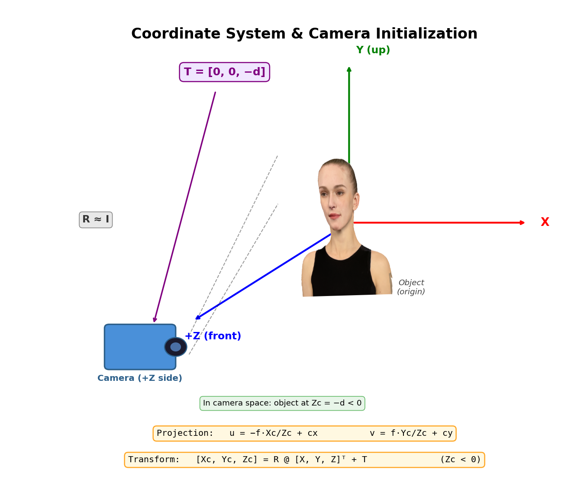
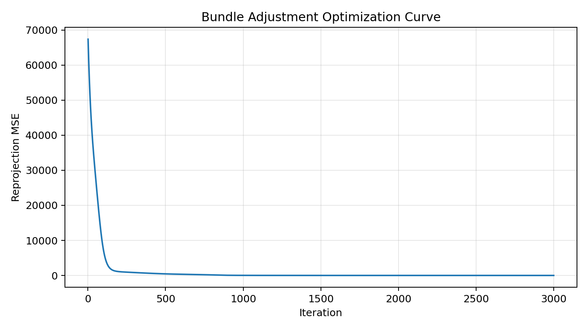
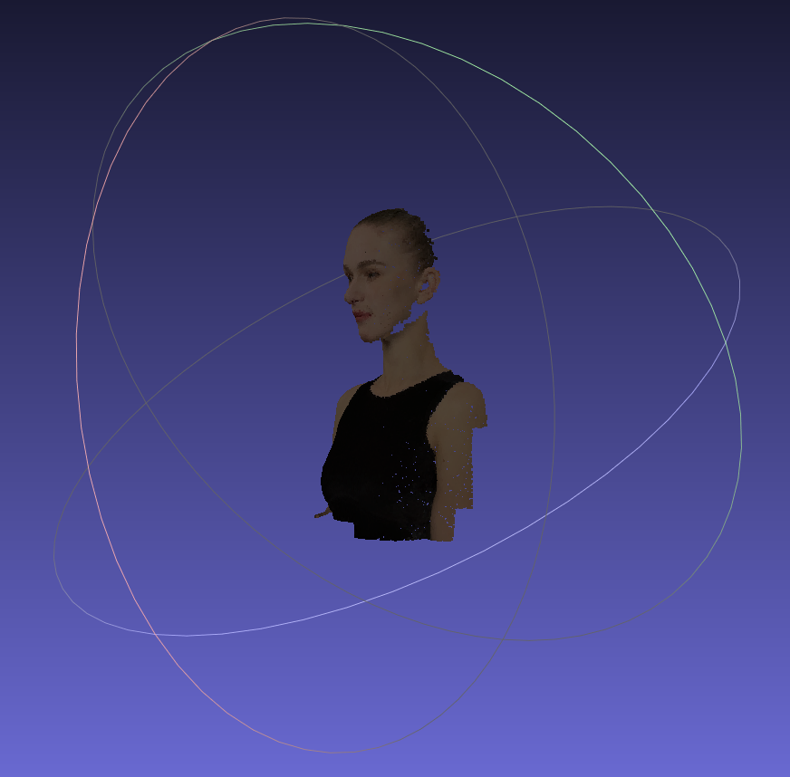
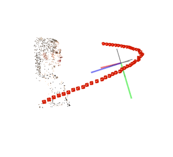

# DIP Assignment 03: Bundle Adjustment Report

This report covers two parts of Assignment 03: (1) Bundle Adjustment implemented with PyTorch, and (2) multi-view 3D reconstruction with COLMAP.

## 1. Introduction

本作业围绕三维重建中的经典问题展开：一方面使用 PyTorch 从 2D 观测中联合优化相机参数和 3D 点坐标；另一方面使用 COLMAP 完成完整的多视图重建流程，并与手工实现的 BA 结果进行对照。

目标是理解 Bundle Adjustment 的建模方式、投影误差如何构造，以及 COLMAP 在真实重建管线中如何自动完成特征提取、匹配、稀疏重建和稠密重建。

## 2. Data

数据集包含 50 个视角下的渲染图像、2D 投影观测和 3D 点颜色信息：

```
data/
├── images/              # 50 rendered views, used for BA visualization and COLMAP
├── points2d.npz         # 2D observations, keys view_000 ~ view_049, each (20000, 3)
└── points3d_colors.npy  # per-point RGB colors, each (20000, 3)
```

`points2d.npz` 中每个视角的数据形状为 `(20000, 3)`，每行格式为 `(x, y, visibility)`：

1. `x, y` 表示该点在该视角下的像素坐标。
2. `visibility` 表示可见性，1 为可见，0 为遮挡。

**Multi-view images & 2D projections:**


上排展示若干视角图像，下排展示对应的 2D 观测点叠加效果。

### Known Information

| Parameter | Value | Description |
|------|-----|------|
| Image Size | 1024 × 1024 | rendered image resolution |
| Num Views | 50 | camera viewpoints |
| Num Points | 20000 | sampled 3D points |

## 3. Method

### 3.1 Bundle Adjustment with PyTorch

本部分的核心是最小化重投影误差，联合优化：

1. 共享焦距 `f`。
2. 每个视角的旋转 `R` 与平移 `T`。
3. 所有 3D 点坐标 `(X, Y, Z)`。

投影模型写为：

$$
[X_c, Y_c, Z_c]^T = R [X, Y, Z]^T + T
$$

$$
u = -f \cdot \frac{X_c}{Z_c} + c_x, \quad v = f \cdot \frac{Y_c}{Z_c} + c_y
$$

其中 `c_x = image_width / 2`、`c_y = image_height / 2`。优化目标为观测点与预测点之间的均方误差，仅在可见点上累积：

$$
\mathcal{L} = \frac{1}{N} \sum \| p_{pred} - p_{obs} \|_2^2
$$

实现中采用 Euler 角参数化旋转，并使用 Adam 进行梯度下降优化。为了保证训练稳定，初始化时将相机放置在物体前方并让 3D 点在原点附近随机分布。

**Coordinate System & Initialization:**



该坐标系下，物体正面朝向 `+Z`，相机位于物体前方。由于相机变换为 `[X_c, Y_c, Z_c] = R @ P + T`，因此当 `R ≈ I` 时，平移通常初始化为 `[0, 0, -d]`，以保证物体位于相机视野内。

#### Expected Result

重建后的 3D 点云应呈现出较完整的头部表面结构，并且颜色与原始采样点保持一致：


### 3.2 COLMAP Reconstruction

COLMAP 部分使用官方命令行工具对 `data/images/` 中的 50 张图像进行重建，流程包括：

1. Feature Extraction。
2. Feature Matching。
3. Sparse Reconstruction / Mapper。
4. Image Undistortion。
5. Dense Reconstruction，包括 Patch Match Stereo 和 Stereo Fusion。

完整命令可参考 [run_colmap.sh](run_colmap.sh)。如果在 Windows 下运行，可以按 COLMAP 官方文档配置可执行文件路径；如果没有 CUDA 环境，也可以只完成到稀疏重建阶段。

## 4. Implementation Details

### 4.1 Task 1

实现要点如下：

1. 读取 `points2d.npz` 和 `points3d_colors.npy`。
2. 使用 PyTorch 张量参数化焦距、相机外参和 3D 点。
3. 通过前向投影计算每个视角的预测 2D 坐标。
4. 仅在可见点上计算重投影误差。
5. 使用优化器更新参数，并记录 loss 变化。
6. 将最终重建点云导出为带颜色的 OBJ 文件，便于查看结果。

运行命令（Task 1）：

```bash
python run_bundle_adjustment.py --iters 3000 --lr 5e-3
```

默认输出目录为 `outputs/`，主要文件包括：

1. `outputs/ba_loss.png`：优化过程 loss 曲线。
2. `outputs/reconstruction.obj`：最终彩色 3D 点云（`v x y z r g b`）。
3. `outputs/ba_params.npz`：优化后的焦距、外参与 loss 历史。

### 4.2 Task 2

COLMAP 流程采用命令行脚本自动执行：

1. 先对图像执行特征提取与匹配。
2. 再进行 mapper 得到稀疏点云和相机位姿。
3. 之后执行 undistortion、patch match stereo 和 stereo fusion。

## 5. Experimental Results and Analysis

### 5.1 BA Result Analysis

从优化结果来看，重投影误差会在训练初期快速下降，随后逐步收敛。若初始化合理，优化后的 3D 点云能够恢复出稳定的头部轮廓；若焦距或相机平移初始化偏差过大，则容易出现收敛缓慢或局部最优。

BA 的优点是可控、可解释，并且能够直接在目标函数层面约束几何一致性；不足是对初始化敏感，并且在大规模点和多视角条件下计算量较高。

BA 优化 loss 曲线：



BA 重建结果（彩色点云截图）：



### 5.2 COLMAP Result Display

COLMAP 重建结果（稀疏可视化）：



### 5.3 Comparison

1. 手工实现的 BA 更适合学习投影模型、误差设计和优化过程。
2. COLMAP 提供了完整、成熟的工程化流程，能够快速得到可用的重建结果。
3. 两者的核心思想一致，都是通过最小化重投影误差恢复相机与三维结构。

## 6. Conclusion

本作业完成了两条三维重建路线：

1. 使用 PyTorch 实现 Bundle Adjustment，从 2D 观测中恢复相机参数和 3D 点云。
2. 使用 COLMAP 完成多视图三维重建，并预留了结果展示位置，方便后续补充实际截图。
3. 通过对比可以看到，几何优化方法和工程化重建工具在思路上统一，但在实现复杂度和自动化程度上存在明显差异。

## 7. References

1. Bundle Adjustment — Wikipedia. Link: https://en.wikipedia.org/wiki/Bundle_adjustment
2. PyTorch Optimization. Link: https://pytorch.org/docs/stable/optim.html
3. pytorch3d.transforms. Link: https://pytorch3d.readthedocs.io/en/latest/modules/transforms.html
4. COLMAP Documentation. Link: https://colmap.github.io/
5. COLMAP Tutorial. Link: https://colmap.github.io/tutorial.html
6. Teaching Slides. Link: https://pan.ustc.edu.cn/share/index/66294554e01948acaf78
